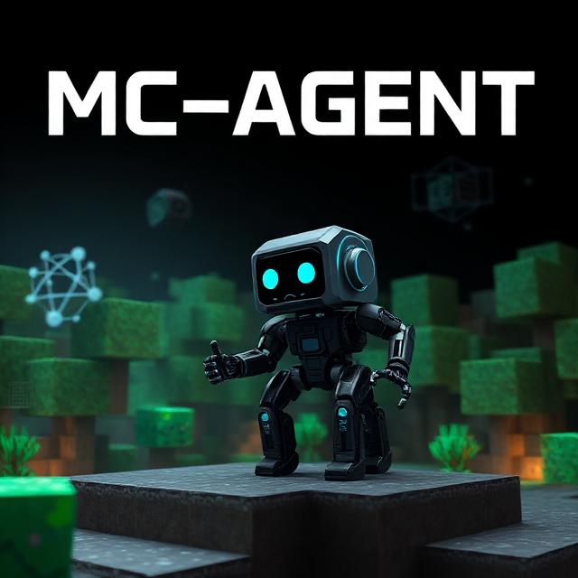

<p align="center">
  
</p>

# MC-Agent

A modern, production-quality, headless Minecraft Java Edition agent built with Mineflayer and TypeScript.

## Features

- Modular architecture with plugin, command, and behavior systems
- Automatic reconnection
- Event-driven design
- Type-safe with strict TypeScript
- Winston logging
- Zod-validated configuration via environment variables
- AI-ready service interfaces

## Requirements

- Node.js >= 22.0.0
- npm >= 9.0.0

## Installation

```bash
npm install
```

## Configuration

Copy `.env.example` to `.env` and configure:

| Variable | Description | Default |
|----------|-------------|---------|
| `SERVER_HOST` | Minecraft server host | `localhost` |
| `SERVER_PORT` | Minecraft server port | `25565` |
| `USERNAME` | Bot username | `mc-agent` |
| `AUTHENTICATION_TYPE` | `microsoft`, `mojang`, or `offline` | `offline` |
| `VIEWER_ENABLED` | Enable prismarine-viewer | `false` |
| `LOGGING_LEVEL` | `error`, `warn`, `info`, or `debug` | `info` |
| `RECONNECT_DELAY` | Reconnect delay in ms | `5000` |
| `MAX_RECONNECT_ATTEMPTS` | Max reconnect attempts | `10` |
| `DEFAULT_FOLLOW_DISTANCE` | Follow distance in blocks | `6` |
| `DEFAULT_MOVEMENT_SPEED` | Movement speed multiplier | `1.2` |

## Running

```bash
npm run build
npm run start
```

## Development

```bash
npm run dev      # Watch mode
npm run lint     # Run ESLint
npm run lint:fix # Auto-fix lint issues
npm run format   # Format with Prettier
npm run test     # Run tests
npm run clean    # Remove build output
```

## Architecture

```
mc-agent/
├── src/
│   ├── bot/           Bot abstraction layer
│   ├── commands/      Command framework
│   ├── behaviors/     Behavior system
│   ├── goals/         Goal planning
│   ├── services/      AI service placeholders
│   ├── plugins/       Plugin system
│   ├── memory/        Short/long-term memory
│   ├── events/        Event manager
│   ├── config/        Configuration with Zod
│   ├── logger/        Winston logger
│   ├── types/         Shared TypeScript interfaces
│   └── utils/         Utility functions
├── tests/             Test files
├── data/              Persistent data
├── logs/              Log files
├── docs/              Documentation
└── scripts/           Build/utility scripts
```

## Plugin Development

Plugins implement the `Plugin` interface:

```typescript
import { Plugin } from '../types/index.js';

const myPlugin: Plugin = {
  name: 'my-plugin',
  version: '1.0.0',
  description: 'My plugin',
  register: async (bot) => {
    bot.events.on('bot:chat', (data) => {
      console.log(data.message);
    });
  },
  unregister: async (bot) => {
    bot.events.removeAllListeners('bot:chat');
  },
};

export default myPlugin;
```

## Command Development

Commands implement the `Command` interface:

```typescript
import { Command, CommandContext } from '../types/index.js';

export const myCommand: Command = {
  metadata: {
    name: 'mycommand',
    aliases: ['mc'],
    description: 'Does something',
    usage: 'mycommand <arg>',
    arguments: ['arg'],
    permissions: [],
  },
  execute: async (ctx: CommandContext) => {
    ctx.bot.chat('Hello!');
  },
};
```

## Behavior Development

Behaviors implement the `Behavior` interface and can be toggled on/off:

```typescript
import { Behavior } from '../types/index.js';

export const myBehavior: Behavior = {
  metadata: {
    name: 'my-behavior',
    description: 'Does something automatically',
  },
  isEnabled: true,
  start: async (bot) => {
    // Start behavior
  },
  stop: async (bot) => {
    // Stop behavior
  },
  toggle: (enabled) => {
    myBehavior.isEnabled = enabled;
  },
};
```

## Troubleshooting

- **Bot won't connect**: Check `SERVER_HOST`, `SERVER_PORT`, and `AUTHENTICATION_TYPE` in `.env`
- **Authentication errors**: Ensure `AUTHENTICATION_TYPE` is set correctly for your account
- **Build errors**: Run `npm run clean && npm install && npm run build`

## Roadmap

See [docs/ROADMAP.md](./docs/ROADMAP.md) for planned features.

## License

MIT